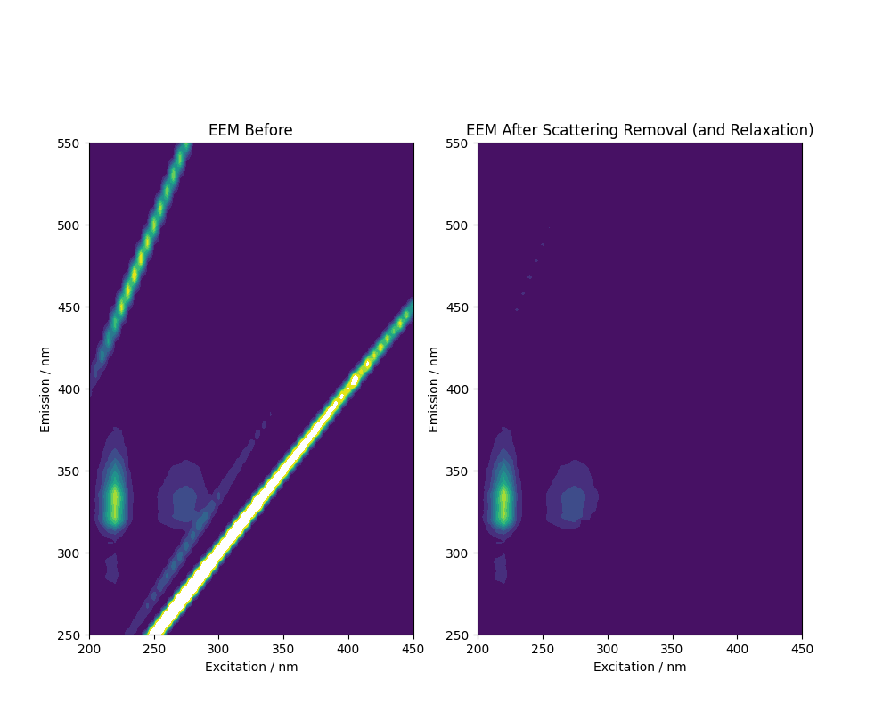

**简体中文 | [English](https://github.com/tgraphite/EEM-Scattering-Remover/blob/main/README.en-US.md)**

## EEM散射去除工具 (ESR) 

1、自动识别Rayleigh、Raman、二级Rayleigh散射条带并切除，不受仪器型号、波长范围影响。
2、可使用弛豫算法修正条带被切除后的空白。
3、易于使用、易于调试，支持**全自动**静默批处理模式，数分钟就可处理数十个文件。

----

## 用法
0) 准备.txt或.xlsx格式的输入文件.   

若使用.txt文件，则需要遵循以下格式，数据块以空格或制表符（Tab）分割：  

    [空格或0.0]	200	205	210	... (激发波长)
    250		1.823	1.785	1.13	...
    252		1.823	1.785	1.13	...
    254		1.823	1.785	1.13	...	
    ...		...	...	...	(吸收值)
    (发射波长)
    (文件内容结束)

若使用.xlsx文件，则需要遵循以下格式：

| (任意内容如仪器型号、日期等) | | | | | | 
| ---- | ---- | ---- | ---- | --- | --- |
| ... | |
| **Data points** | |
| [空格或0.0] | 200 | 205 | 210 | ... | (激发波长) |
| 250 | 1.823 | 1.785 | 1.13 | ... | 
| 252 | 1.823 | 1.785 | 1.13 | ... | 
| 254 | 1.823 | 1.785 | 1.13 | ... | 
| ... | ... | ... | ... | (吸收值)
| (发射波长)
| (文件内容结束)

1) 双击运行exr.exe  
2) 等待数秒，将一个数据文件直接拖入窗口，并按回车继续。也可拖入一个装有若干数据文件的文件夹，则程序会进入全自动模式，依次对文件夹内的文件进行处理，文件夹内不可有无关的.txt或.xlsx文件。  
3) 程序会呼出一个预览图界面，浏览并关闭预览图后，即自动保存预览图和处理后的数据。（全自动模式不会打开预览图，而是直接保存）  
4) 按任意键退出。  
5) 对效果不满意时，可修改esr-params里的参数，若这个文件丢失或格式错误，则会使用默认参数。  

**注意**：大部分错误都是由格式引起的，请严格比照格式制作输入文件，并且程序和文件的路径（保存位置）里最好不要有空格、特殊字符、非西文字符。

----

## 参数设置  
  
esr-params.txt里各参数的具体含义：  

|  参数  |  默认值  |  说明 |
| ---- | ---- | ---- |
| ray-remove-rad | 10.0 | Rayleigh散射条带切除的半径（宽度的一半）。
| secray-remove-rad | 12.0 | 二级Rayleigh散射条带切除的半径。
| ram-remove-rad | 10.0 | Raman散射条带切除的半径。
| ram-wavenumber | 3600.0 | Raman散射的波数（取决于溶剂的性质），会影响Raman散射条带切除的位置。对于水，约为3600。
| relaxation-disp | 3.0 |  当散射条带被切除后，程序会在被切除的点附近寻找临近参考点，上下左右四个（边角不够四个的，值取0），使用其平均值填补被切除的空白。弛豫位移是上下左右移动的数据块数，其乘以激发或发射的波长间距才是坐标上的真实距离。设置的弛豫位移值越大，最终效果里接近被切除的地方越模糊，越小则越锐利，过大或过小会失去物理意义。设置为0则不使用弛豫算法，直接切除。

----

## 示例
